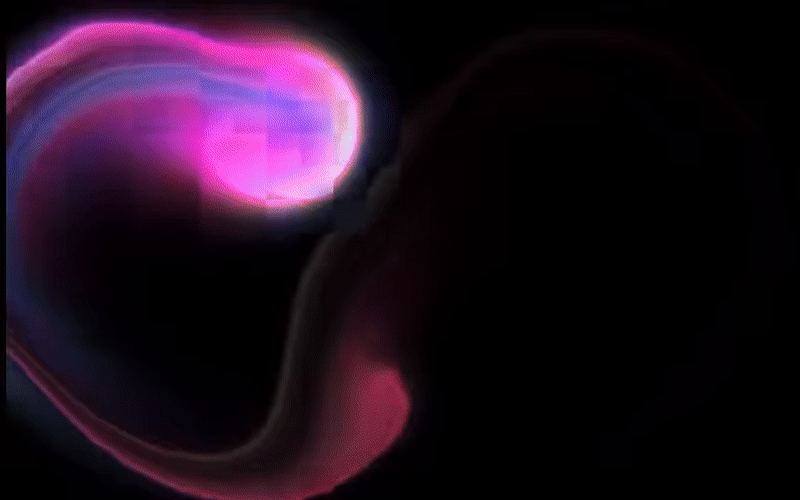

<div align="center">
  <h1>✨ Fluid Cursor ✨</h1>
  <p>A beautiful, interactive WebGL fluid simulation cursor overlay for your entire Windows Desktop.</p>
</div>

<br />

Turn your boring Windows mouse movements into a mesmerizing, interactive fluid simulation! Built with React and wrapped natively using Electron, this app creates a transparent, click-through overlay that responds to your mouse natively on your desktop.

### 🎥 See it in Action


### 🌐 Try it Live (No Install Required)
You can test the fluid cursor directly in your browser right now!
👉 **[Click here to try the Live Web Demo](https://anujsehrawat1.github.io/FluidCursorApp/)**

## 🚀 Features

- **Global Desktop Overlay:** Runs smoothly over all your windows, wallpaper, and taskbar natively.
- **100% Click-Through:** Zero interruptions to your workflow. You click right through the fluid as if it wasn't there!
- **Auto-Start:** Automatically launches silently when your PC boots.
- **Ultra Lightweight:** Uses minimal resources thanks to WebGL hardware acceleration.
- **One-Click Install/Uninstall:** Comes with a simple Windows Installer (`.exe`).

## 📥 Installation

1. Go to the [Releases](../../releases/latest) page of this repository.
2. Download the `Fluid Cursor Setup 0.0.0.exe` file.
3. Double-click to install! It will automatically start the fluid effect and add itself to your startup tasks.

*To uninstall, simply remove it via Windows Apps & Features, or run the `Uninstall.exe` generated in the installation folder.*

## 💻 Development

Want to build it from source or modify the colors and physics? It's easy!

```bash
# Clone the repository
git clone https://github.com/anujsehrawat1/FluidCursorApp.git

# Navigate into the project
cd FluidCursorApp

# Install dependencies
npm install

# Test in development mode
npm start

# Build your own native .exe installer
npm run build-exe
```

## 🛠️ Modifying the Effects

You can change the color, physics, and behavior of the fluid!
Open `src/App.jsx` and modify the props passed to `<SplashCursor />`. 

```jsx
<SplashCursor 
  COLOR="#A855F7"         // Your custom hex color
  RAINBOW_MODE={false}    // Set to true for RGB mode!
  TRANSPARENT={true}      // Keep this true for desktop overlay
  SPLAT_RADIUS={0.2}      // Size of the fluid splash
  SPLAT_FORCE={6000}      // Force of your mouse movement
/>
```
*Run `npm run build-exe` again after making changes to package your new custom installer.*

## 🙏 Credits

The WebGL fluid simulation logic is based on the incredible open-source `SplashCursor` React component from [React Bits](https://reactbits.dev).

Built for Windows by Anuj.
